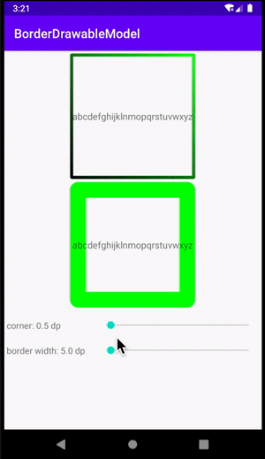
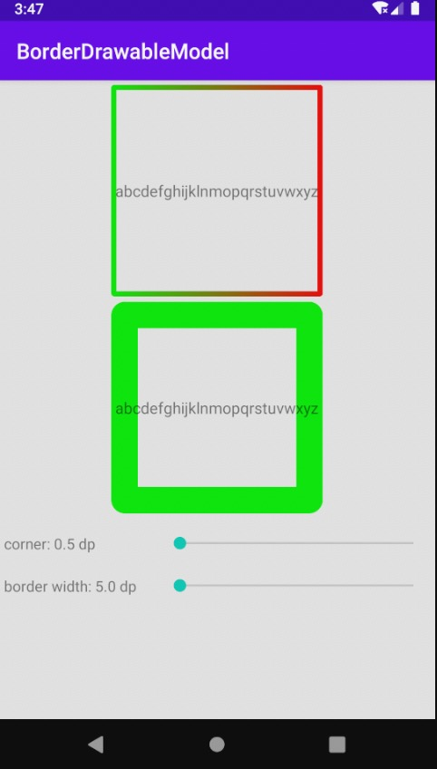
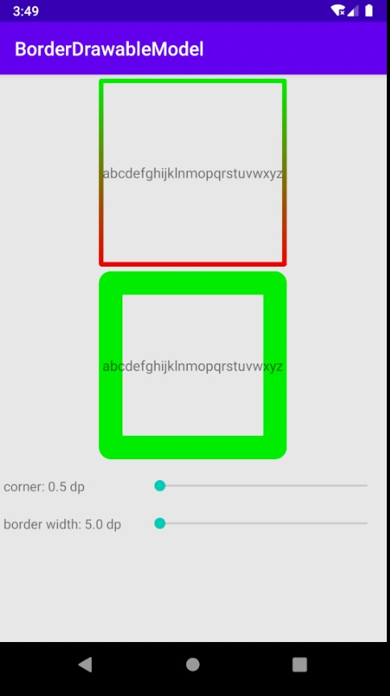
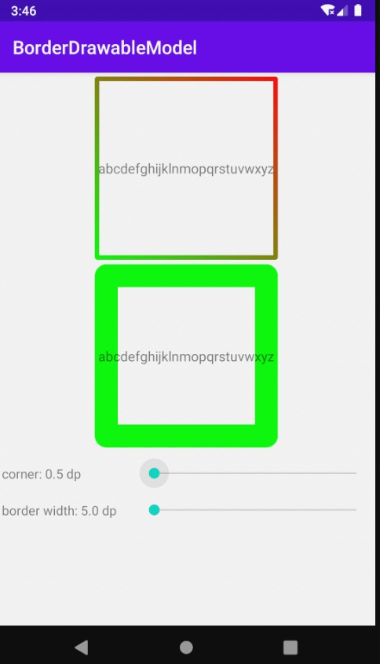

# 渐变边框GradientBorderDrawable

### android没有提供渐变边框的实现，所以通过自定义的方式实现了GradientBorderDrawable
### 效果如下，上方是GradientBorderDrawable，下方是通过drawable.xml设置的边框：

目前支持动态修改圆角`corner`和边框宽度`border_width`

### xml设置边框代码如下：
```xml
<?xml version="1.0" encoding="utf-8"?>
<shape xmlns:android="http://schemas.android.com/apk/res/android"
    android:shape="rectangle">
    <corners android:radius="0.5dp"/>
    <stroke android:width="25dp" android:color="#FF00FF00"/>
</shape>
```

## 使用
### kotlin使用

```kotlin
GradientBorderDrawable(
            borderColors = intArrayOf(Color.GREEN, Color.RED), // 边框色，支持多色
            bgColors = intArrayOf(Color.TRANSPARENT, Color.TRANSPARENT), //背景色，支持多色
            borderWidth = 5f.dpF, //边框宽度 单位px
            corner = 0.5f.dpF, //圆角 单位px
            borderAngle = GradientBorderDrawable.ANGLE_LEFT_TOP_BOTTOM_RIGHT, //边框多色值情况下，选择渐变方向
            bgAngle = GradientBorderDrawable.ANGLE_LEFT_BOTTOM_RIGHT_TOP // 背景色多色值情况下，选择渐变方向
        )
```

### java使用
可通过GradientBorderBuilder创建GradientBorderDrawable对象，也可以直接创建GradientBorderDrawable对象

```java
GradientBorderBuilder()
            .setBorderColors(intArrayOf(Color.GREEN, Color.RED)) // 边框色，支持多色
            .setBgColors(intArrayOf(Color.TRANSPARENT, Color.TRANSPARENT)) //背景色，支持多色
            .setBorderWidth(5f.dpF) //边框宽度 单位px
            .setCorner(0.5f.dpF) //圆角 单位px
            .setBorderAngle(GradientBorderDrawable.ANGLE_LEFT_BOTTOM_RIGHT_TOP) //边框多色值情况下，选择渐变方向
            .setBgAngle(GradientBorderDrawable.ANGLE_LEFT_BOTTOM_RIGHT_TOP) // 背景色多色值情况下，选择渐变方向
            .build()
```


## borderAngle和bgAngle
内置了四种渐变角度：
* `ANGLE_LEFT_RIGHT`： 从左到右渐变
* `ANGLE_TOP_BOTTOM`： 从上到下渐变
* `ANGLE_LEFT_TOP_BOTTOM_RIGHT`： 从左上到右下渐变
* `ANGLE_LEFT_BOTTOM_RIGHT_TOP`： 从左下到右上渐变
<center>
	
	
	
	
</center>

##Extra!
如有需要扩充的需求，大家可以提在issue上，让类库功能变得更加完善。
