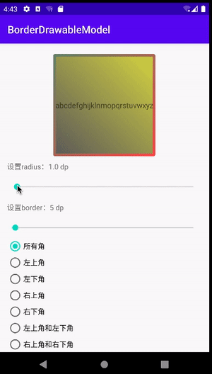
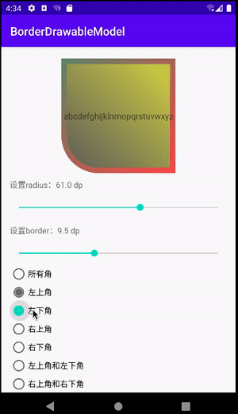
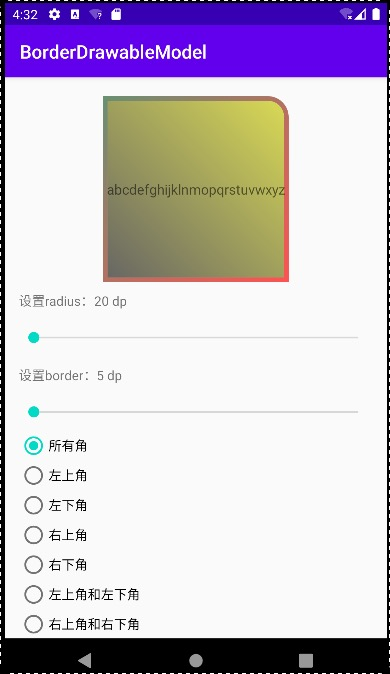
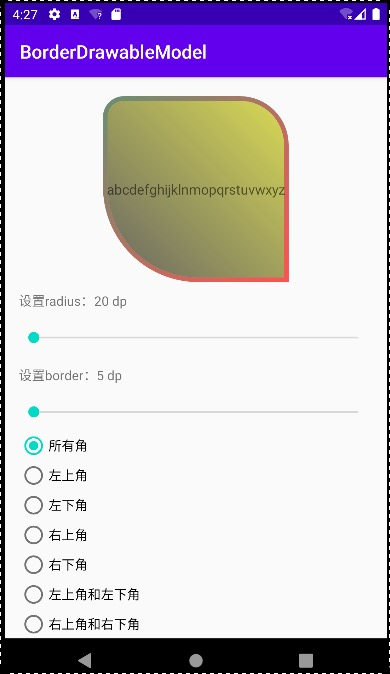
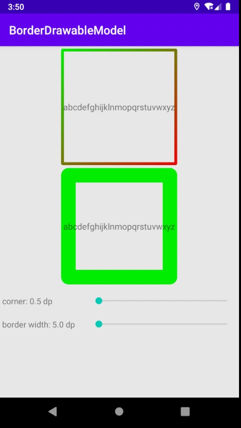

# 渐变边框GradientBorderDrawable

[](https://jitpack.io/#gfzy9876/GradientBorderDrawable)
### android没有提供渐变边框的实现，所以通过自定义的方式实现了GradientBorderDrawable 
### 效果如下，上方是GradientBorderDrawable，下方是通过drawable.xml设置的边框：



目前支持:
* 动态修改圆角`corner`
* 边框宽度`border_width`
* 支持`指定某几个角`实现圆角

## 使用

首先在Application初始化：
```kotlin
GradientBorderInit.init(Context)
```

### kotlin使用

####直接指定四个角的圆角半径(radius)创建：

```kotlin
GradientBorderDrawable(
  borderColors = intArrayOf(resources.getColor(R.color.border_left_color), resources.getColor(R.color.border_right_color)), // 边框色，支持多色
  bgColors = intArrayOf(resources.getColor(R.color.inner_left_color), resources.getColor(R.color.inner_right_color)),  // 背景色，支持多色
  borderWidth = 5f.dpF, // 边框宽度 单位px
  radius = radiusPx, // 圆角 单位px
  borderAngle = GradientBorderDrawable.ANGLE_LEFT_RIGHT, // 边框多色值情况下，选择渐变方向
  bgAngle = GradientBorderDrawable.ANGLE_LEFT_RIGHT // 背景色多色值情况下，选择渐变方向
)
```

#### 当不同位置角需要的圆角半径相同时，但是需要指定某几个角有圆角，可通过radiusType方式创建：

```kotlin
GradientBorderDrawable(
  borderColors = intArrayOf(resources.getColor(R.color.border_left_color), resources.getColor(R.color.border_right_color)), // 边框色，支持多色
  bgColors = intArrayOf(resources.getColor(R.color.inner_left_color), resources.getColor(R.color.inner_right_color)), // 背景色，支持多色
  borderWidth = 5f.dpF, // 边框宽度 单位px
  radius = radiusPx, // 圆角 单位px
  radiusType = GradientBorderDrawable.RadiusType.RT, //指定四个角的哪几个角有圆角（当需要圆角角度一样时才能使用）
  borderAngle = GradientBorderDrawable.ANGLE_LEFT_TOP_BOTTOM_RIGHT, // 边框多色值情况下，选择渐变方向
  bgAngle = GradientBorderDrawable.ANGLE_LEFT_BOTTOM_RIGHT_TOP // 背景色多色值情况下，选择渐变方向
)
```

其中，RadiusType取值如下：

```kotlin
enum class RadiusType {
  // 四个角
  ALL,
  // 左上角、左下角、右上角、右下角
  LT, LB, RT, RB,
  // 左上角和左下角、右上角和右下角、左上角和右上角、左下角和右下角、左上角和右下角、左下角和右上角
  L, R, T, B, LT_RB, LB_RT,
  // 除了左上角、除了左下角、除了右上角、除了右下角
  EXCEPT_LT, EXCEPT_LB, EXCEPT_RT, EXCEPT_RB
}
```

<div align="center">

</div>


#### 当不同位置角需要的圆角半径不同时，通过以下构造方法创建：

```kotlin
GradientBorderDrawable(
  borderColors = intArrayOf(resources.getColor(R.color.border_left_color), resources.getColor(R.color.border_right_color)), // 边框色，支持多色
  bgColors = intArrayOf(resources.getColor(R.color.inner_left_color), resources.getColor(R.color.inner_right_color)), // 背景色，支持多色
  borderWidth = 5f.dpF, // 边框宽度 单位px
  // 圆角半径 单位px，分别指定4个圆角半径，共8个元素，每个圆角两个数组元素，分别表示x方向圆角半径 和 y方向圆角半径
  // 索引和对应值：0,1 左上角; 2,3 右上角; 4,5 右下角; 6,7 左下角
  radii = floatArrayOf(20f.dpF, 20f.dpF, 50f.dpF, 50f.dpF, 0f, 0f, 100f.dpF, 100f.dpF),
  borderAngle = GradientBorderDrawable.ANGLE_LEFT_TOP_BOTTOM_RIGHT, // 边框多色值情况下，选择渐变方向
  bgAngle = GradientBorderDrawable.ANGLE_LEFT_BOTTOM_RIGHT_TOP // 背景色多色值情况下，选择渐变方向
)
```
<div align="center">

</div>


### java使用
可通过GradientBorderBuilder创建GradientBorderDrawable对象，也可以直接创建GradientBorderDrawable对象

```java
GradientBorderBuilder()
            .setBorderColors(intArrayOf(Color.GREEN, Color.RED)) // 边框色，支持多色
            .setBgColors(intArrayOf(Color.TRANSPARENT, Color.TRANSPARENT)) //背景色，支持多色
            .setBorderWidth(5f.dpF) //边框宽度 单位px
            .setCorner(0.5f.dpF) //圆角 单位px
            .setBorderAngle(GradientBorderDrawable.ANGLE_LEFT_BOTTOM_RIGHT_TOP) //边框多色值情况下，选择渐变方向
            .setBgAngle(GradientBorderDrawable.ANGLE_LEFT_BOTTOM_RIGHT_TOP) // 背景色多色值情况下，选择渐变方向
            .build()
```


## borderAngle和bgAngle
内置了四种渐变角度：
* `ANGLE_LEFT_RIGHT`： 从左到右渐变
* `ANGLE_TOP_BOTTOM`： 从上到下渐变
* `ANGLE_LEFT_TOP_BOTTOM_RIGHT`： 从左上到右下渐变
* `ANGLE_LEFT_BOTTOM_RIGHT_TOP`： 从左下到右上渐变
<div align="center">




</div>

##Extra!
如有需要扩充的需求，大家可以提在issue上，让类库功能变得更加完善。
